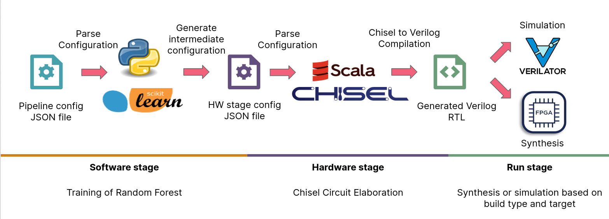

# Build system

This document describes the build system of the Random Forest classifier project.

## Build type and target

The build type and target determine the final products that the build pipeline generates.

### Build types

The build type decides which type of design is generated during the build. There are two possible build types:

- `test` -- The test build type generates a "test harness" module that wraps around a random forest classifier module. This module contains the test data and expected results and automatically tests the random forest classifier module. This build is meant for development and verification purposes.

- `production`-- The production build type will generate a random forest classifier module with appropriate communication support. This build is meant for deploying to production.

***NOTE: Currently only test builds are supported. Support for production builds will be added in the future***

### Build target

The build target decides what is done with the generated verilog design during the build. There are two possible build targets:

- `simulation` -- The simulation build target may be used to simulate the generated verilog design. It builds a verilator-based simulator model and runs the simulator to verify the behaviour of the module.

- `synthesis` -- The synthesis build target may be used when the generated modules is to be synthesised by an external FPGA tool chain. The synthesis builds basically cause the build pipeline to exit after verilog generation from chisel.

## Build pipeline stages

The build pipeline is divided into three main stages. The stages and overall pipeline have been implemented with Scala and can be found in [/src/main/scala/psrf/buildpipe](../src/main/scala/psrf/buildpipe).

### Software stage

The software stage performs the training of the random forest classifier.

First it creates a python virtual environment in the project and installs the required libraries. More information about python virtual environments may be found [here](https://docs.python.org/3/tutorial/venv.html). Then it runs a python script that:

- Reads the input pipeline configuration JSON file.
- Loads and splits the dataset into training and testing data.
- Performs the fitting/training of the random forest classifier.
- Outputs the decision trees data structure and other configurations to the hardware stage as a JSON file.

The python script can be found in [/src/main/python](../src/main/python).

### Hardware stage

The hardware stage generates the verilog design based on input configuration.

It reads the configuration JSON file generated by the software stage. Then it supplies the required chisel generator module (determined by the build type), with necessary parameters and performs the circuit elaboration/compilation.

### Run stage

The run stage takes the generated verilog and performs the necessary actions based on the build target. It either builds and run the verilator-based simulator or outputs the generated verilog file for further syntheis. The wrapper C++ classes used for the verilator simulator can be found in [/src/main/cpp](../src/main/cpp).
